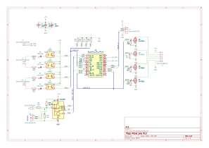

### A 4 inputs 4 outputs PLC board based on [Arduino micro pro] (or clone) to drive a 4 Way [relay board] and made to run with [open_PLC]

### Status:

work in progress...

__Micro pro PLC__ is a  small _Programable Logic Controlor_ board based on [Arduino micro pro] (ATmega32U4 microcontroler).
It is designed for small systems with 4 digital inputs, 4 digital outputs, 2 analog inputs and a Modbus/RS485 access.
It is designed to fit on easy available 4 way [relay board]

I first designed it for use with [open_PLC] but it can be use with Arduino IDE or any other way you want to devellop the software you put on the controler

### Simulated 3D view

### Connection diagram

### Arduino pins used

| Board pin | Arduino pin |
| :-------- | :-----------|
| I0.0 | D2 |
| I0.1 | D3 |
| I0.2 | D4 |
| I0.3 | D5 |
| Output0 | D7 |
| Output1 | D8 |
| Output2 | D14 |
| Output3 | D15 |
| IW0.0 | A0 |
| IW0.1 | A1 |

- Modbus/RS485 drived by D1 for Tx and D0 for RX (Serial1)
- RS485 is enabled by D6
- Outputs open drain - 200mA drain output
- Input actived by pooling to GND (need to drain ~20mA)

### Schematic

PDF version available [here](./Docs/pro_micro_plc_sch.pdf)

### BOM
|Reference |Value |Footprint|
|:---------|:-----|:--------|
|C1,C2,C3  |100nF |SMD 0805 |
|D1,D2,D3,D4 |LED_3mm ||
|J1 |01x06_Pin |PinSocket_2.54mm |
|J2,J3,J4 ||TerminalBlock_Phoenix_MKDS 5.00mm |
|J5 |01x02_Pin |PinHeader_2.54mm |
|J6,J7 |01x04_Pin |PinHeader_2.54mm or JST HX|
|Q1,Q2,Q3,Q4 |2N7002K |SOT-23 |
|R1,R2,R3,R4 |10k |SMD 0805 |
|R5,R6,R7,R8 |4k7 |SMD 0805 |
|R9 |120 |SMD 0805 |
|R10,R11,R12,R13 |100 |SMD 0805 |
|R14,R15 |20k |SMD 0805 |
|U1 |Sparkfun_Pro_Micro or Clone|
|U2,U3,U4,U5 |PC817 |DIP4 |
|U6 |MAX485E |DIP8 |

also available [here](./Docs/pro_micro_plc_BOM.md)

[open_PLC]: https://autonomylogic.com/
[Arduino micro pro]: https://www.sparkfun.com/products/12640
[relay board]: https://fr.aliexpress.com/item/1005002867727977.html
